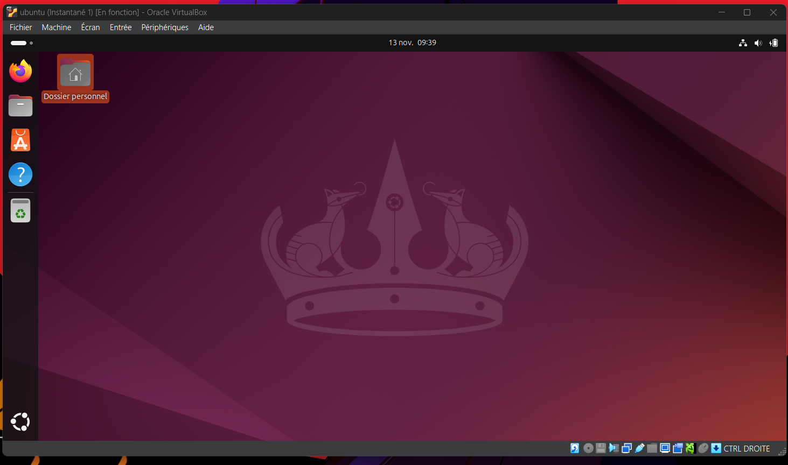

## Guide rapide du bureau Ubuntu

## Introduction
Comme on peut le voir, Ubuntu a une interface elegante et une facilite d'utilisation ainsi que des couleur violace reconnaissable. Dans ce guide nous allons faire un tour de ce que l'on voit a l'ecran  presenter les elements essentiels de son interface.

## 1. Le Dock (Barre laterale)
Le dock est situe sur le cote gauche de l'ecran et contient :
-  **Firefox** : Navigateur web par defaut
-  **Dossier personnel** : Gestionnaire de fichiers
-  **Ubuntu Software** : Boutique d'applications
-  **Aide Ubuntu** : Documentation et support
-  **Corbeille** : Fichiers supprimes
- Autres applications epinglees par l'utilisateur

## 2. La Barre superieure
Situee en haut de l'ecran, elle affiche :
- Menu systeme (coin superieur gauche)
- Heure et date (centre)
- Indicateurs systeme (coin superieur droit)
  - Volume
  - Reseau
  - Bluetooth
  - Parametres rapides

## 3. Le Bureau
- **Fond d'ecran** : Theme violet caracteristique d'Ubuntu
- **Bureaux virtuels** : 
  - Permet de creer plusieurs espaces de travail
  - Navigation facile entre les taches
  - Activation avec la touche Windows + Page Up/Down

## 4. Fonctionnalites rapides
- **Recherche** : Appuyez sur la touche Windows
- **Vue d'ensemble** : Windows + Tab
- **Terminal** : Ctrl + Alt + T
- **Changement rapide d'application** : Alt + Tab

## 5. Personnalisation
Le bureau Ubuntu peut etre personnalise :
- Themes
- Position du dock
- Raccourcis clavier
- Extensions GNOME
- Fonds d'ecran

## 6. Applications par defaut
Ubuntu inclut des applications essentielles :
- LibreOffice (bureautique)
- Thunderbird (email)
- Rhythmbox (musique)
- Photos (gestion d'images)
- et bien d'autres...

### Sites officiels en francais

- Documentation Ubuntu francophone : [https://doc.ubuntu-fr.org](https://doc.ubuntu-fr.org)
- Forum officiel Ubuntu-fr : [https://forum.ubuntu-fr.org](https://forum.ubuntu-fr.org)
- Wiki Ubuntu francophone : [https://doc.ubuntu-fr.org](https://doc.ubuntu-fr.org/)
